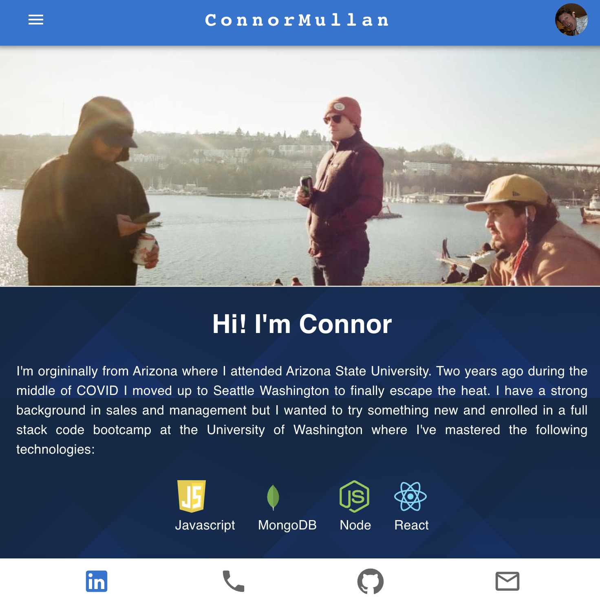

# React Portfolio   
   
## Description

This is my portfolio created using react and deployed using github pages. I used MUI for CSS framework. You can view my latest projects find contact info and my most recent resume. This webstie was designed mobile forward and meant to function best on a mobile device. I have enjoyed how much easier it is to work with React. 

 

## Table of Contents 

* [Installation](#installation)
* [Usage](#usage)
* [License](#license)
* [Contributing](#contributing)
* [Tests](#tests)
* [Questions](#questions)

## Installation

The project can be installed to an npm run build terminal command. 

## Usage

You can use my project to find the most recent portfolio information for myself.

## License
This project is licensed under the MIT License license.

## Contributing

Others can contribute by downloading the repo and adding to it.

## Tests

You can test my project by accessing the website online and viewing it.

## Questions

If you have any questions please contact me through the methods below:

  Github: [cmullan602](https://github.com/cmullan602)

  Email: [cmullan602@gmail.com](mailto:cmullan602@gmail.com)

